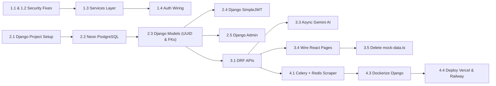

# Migration Tracker — TechStock-AI

> **Version**: 1.1 · **Date**: 2026-07-26 · **Status**: Planning (Updated for Django Target)

---

## 1. Current State Assessment

### 1.1 Technical Debt Inventory

| # | Debt Item | Severity | Impact | Location |
|---|-----------|----------|--------|----------|
| TD1 | **Monolithic Flask backend** — 1,488 lines in single file | 🔴 High | Unscalable, untestable | `backend/app.py` |
| TD2 | **Dual data store** — SQLite + in-memory list, manual sync | 🔴 High | Data drift, race conditions | `backend/app.py L208-225` |
| TD3 | **Frontend auth stub** — setUser() without API calls | 🔴 High | No real authentication | `src/contexts/AuthContext.tsx L27-34` |
| TD4 | **Mock data in frontend** — Dashboard uses mock-data.ts | 🔴 High | UI doesn't reflect real data | `src/pages/Dashboard.tsx L46-50` |
| TD5 | **Hardcoded secrets** — API keys and JWT secrets in source | 🔴 Critical | Security vulnerability | `backend/app.py L50-51, L1438` |
| TD6 | **No FK constraints** — SaleRecordModel.productId not linked | 🟡 Medium | Orphan records possible | `backend/app.py L118` |
| TD7 | **Random ID generation** — `random.randint(1000,9999)` for PKs | 🟡 Medium | Collision at scale | `backend/app.py L578` |
| TD8 | **No API service layer** — Empty `src/services/` directory | 🟡 Medium | No abstraction for API calls | `src/services/` |
| TD9 | **Mock competitor prices** — All hardcoded dictionaries | 🟡 Medium | No real market data | `backend/app.py L889-900` |
| TD10 | **No Admin Panel** — Managing users/stores requires DB scripts | 🟡 Medium | Operational burden | Backend |

---

## 2. Migration Phases (Django Architecture)

### Phase 1: Security, Environment & Service Layer (Week 1-2)
> **Goal**: Secure legacy app, extract secrets, build frontend API services layer.

| # | Task | Priority | Effort | Depends On | Status |
|---|------|----------|--------|------------|--------|
| 1.1 | Remove hardcoded Gemini API key from `backend/app.py L1438` | P0 | 0.5h | — | ⬜ |
| 1.2 | Generate strong `SECRET_KEY` and `JWT_SECRET_KEY`, enforce via `.env` | P0 | 1h | — | ⬜ |
| 1.3 | Create frontend API service layer in `src/services/` (auth, inventory, sales, AI) | P0 | 6h | — | ⬜ |
| 1.4 | Wire `AuthContext.tsx` to call backend `/api/auth/login` & `/api/auth/register` | P0 | 4h | 1.3 | ⬜ |
| 1.5 | Create `.env.example` templates for both Frontend & Django Backend | P1 | 1h | 1.2 | ⬜ |

---

### Phase 2: Django Core & PostgreSQL Setup (Week 3-5)
> **Goal**: Initialize Django project, replace SQLite with Neon PostgreSQL, and configure Django Admin.

| # | Task | Priority | Effort | Depends On | Status |
|---|------|----------|--------|------------|--------|
| 2.1 | Initialize Django 5.0+ project structure (`backend/django_app/` with modular apps) | P0 | 4h | — | ⬜ |
| 2.2 | Connect Django to **Neon Serverless PostgreSQL** via `DATABASE_URL` (SQLite fallback for dev) | P0 | 2h | 2.1 | ⬜ |
| 2.3 | Define Django ORM models (`Store`, `InventoryItem`, `SaleRecord`, `PriceHistory`) with UUID PKs & FKs | P0 | 6h | 2.2 | ⬜ |
| 2.4 | Configure **Django SimpleJWT** authentication & user role permissions | P0 | 4h | 2.3 | ⬜ |
| 2.5 | Configure **Django Admin (`/admin`)** with custom list displays, filters & search | P1 | 4h | 2.3 | ⬜ |
| 2.6 | Write data migration/seed script from legacy mock data | P1 | 4h | 2.3 | ⬜ |

---

### Phase 3: Django API Layer & Frontend Wiring (Week 6-8)
> **Goal**: Implement APIs using DRF, eliminate in-memory store & mock-data.ts.

| # | Task | Priority | Effort | Depends On | Status |
|---|------|----------|--------|------------|--------|
| 3.1 | Implement Inventory & Sales CRUD APIs using DRF | P0 | 8h | Phase 2 | ⬜ |
| 3.2 | Implement Price Tracker & Recommendation APIs | P0 | 6h | 3.1 | ⬜ |
| 3.3 | Implement Gemini 2.0 Flash AI Chat & PC Build Generator in Django async views | P0 | 6h | 3.1 | ⬜ |
| 3.4 | Wire all 15 React pages to call Django APIs via TanStack Query | P0 | 10h | 3.1, 3.2 | ⬜ |
| 3.5 | Delete `src/lib/mock-data.ts` (38KB) once all pages are fully connected | P1 | 0.5h | 3.4 | ⬜ |
| 3.6 | Port scikit-learn ML models into `apps/ai_advisor/ml.py` module | P1 | 6h | Phase 2 | ⬜ |

---

### Phase 4: Background Tasks, Caching & Deployment (Week 9-12)
> **Goal**: Celery + Upstash Redis setup, production deployment to Vercel & Railway.

| # | Task | Priority | Effort | Depends On | Status |
|---|------|----------|--------|------------|--------|
| 4.1 | Set up **Celery + Upstash Redis** for scheduled competitor price scraping | P1 | 10h | Phase 3 | ⬜ |
| 4.2 | Add Upstash Redis caching for Dashboard & Analytics endpoints | P1 | 4h | Phase 3 | ⬜ |
| 4.3 | Dockerize Django backend (`Dockerfile` + `docker-compose.yml`) | P1 | 4h | Phase 3 | ⬜ |
| 4.4 | Deploy Frontend to **Vercel** and Backend to **Railway / Render** | P1 | 4h | 4.3 | ⬜ |
| 4.5 | Integrate Sentry error tracking & PostHog user analytics | P2 | 3h | 4.4 | ⬜ |
| 4.6 | Perform end-to-end load testing & mobile responsiveness audit | P2 | 6h | 4.4 | ⬜ |

---

## 3. Dependency Graph

---

## 4. Effort Summary

| Phase | Tasks | Total Effort | Calendar Time | Cumulative |
|-------|-------|-------------|---------------|------------|
| Phase 1: Security & Service Layer | 5 | ~12.5 hours | 2 weeks | Week 2 |
| Phase 2: Django Core & PostgreSQL | 6 | ~24 hours | 3 weeks | Week 5 |
| Phase 3: Django API Layer & Wiring | 6 | ~36.5 hours | 3 weeks | Week 8 |
| Phase 4: Celery, Caching & Deploy | 6 | ~31 hours | 4 weeks | Week 12 |
| **Total** | **23** | **~104 hours** | **12 weeks** | — |

---

## 5. Summary Table

| Phase | Focus | Deliverable |
|-------|-------|-------------|
| Phase 1 | Security & Service Layer | Hardened auth API, frontend HTTP client |
| Phase 2 | Django Core & Database | **Django 5.0+ ORM**, **Neon PostgreSQL**, **Django Admin (`/admin`)** |
| Phase 3 | API Layer & React Integration | **DRF APIs**, TanStack Query wiring, no mock data |
| Phase 4 | Automation & Production Deploy | **Celery + Redis** price scraping, **Vercel + Railway** deployment |
