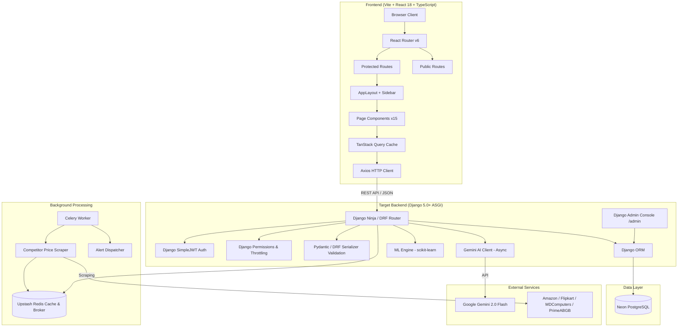
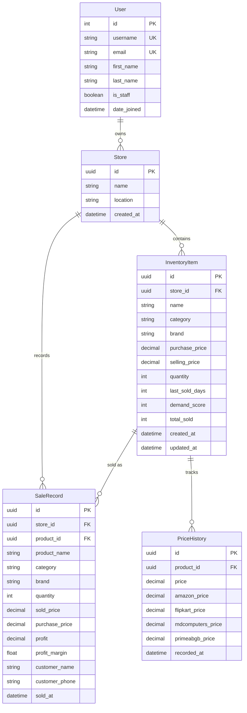

# Technical Design Document (TDD) — TechStock-AI

> **Version**: 1.1 · **Date**: 2026-07-26 · **Status**: Target Design (Updated for Django Architecture)

---

## 1. System Architecture Overview

### Target Django Architecture



### Architecture Comparison: Legacy vs. Target

| Property | Legacy State (Flask) | Target State (Django 5.0+) |
|----------|----------------------|----------------------------|
| Pattern | Monolithic single file `app.py` | Modular Django apps (`apps/inventory`, `apps/sales`, etc.) |
| Database & ORM | SQLite + SQLAlchemy dual store | **Neon PostgreSQL + Django ORM** (relational, multi-tenant) |
| Administration | None | Built-in **Django Admin (`/admin`)** for store & inventory management |
| Auth & Permissions | Custom JWT cookie (stub on frontend) | **Django Auth + SimpleJWT** (token refresh, RBAC rules) |
| API Framework | Raw Flask routes | **Django Ninja** (Pydantic-native async APIs) or **DRF** |
| Task Queue | None (blocking) | **Celery + Upstash Redis** (background price scraping & alert emails) |
| Deployment | Gunicorn (single worker script) | **Railway / Render** (ASGI Uvicorn/Daphne) + **Vercel** (Frontend) |

---

## 2. Target Data Models & Schema Design (Django ORM)

### 2.1 Django Models (`apps/models.py`)



### 2.2 Schema Improvements over Legacy State

| Area | Legacy State | Django Target Fix |
|------|--------------|-------------------|
| Primary Keys | String with `random.randint` collision risk | Native `UUIDField(default=uuid.uuid4, primary_key=True)` |
| Foreign Keys | No FK on SaleRecord → InventoryItem | Explicit Django `models.ForeignKey` with `on_delete=models.PROTECT` |
| Tenant Isolation | None | Mandatory `store_id` ForeignKey on all business models |
| Timestamps | String timestamps `soldAt` | Native `models.DateTimeField(auto_now_add=True)` |
| Dual Store Drift | In-memory `INVENTORY_DATA` list | Single Source of Truth: **Neon PostgreSQL** |
| Currency Precision | Floats (rounding issues) | Native `models.DecimalField(max_digits=12, decimal_places=2)` |

---

## 3. Target API Design — Endpoint Catalog (Django Ninja / DRF)

### 3.1 Authentication & User Management (`apps/authentication`)

| Method | Endpoint | Auth Required | Description |
|--------|----------|---------------|-------------|
| POST | `/api/auth/register/` | Public | Register user + store profile |
| POST | `/api/auth/token/` | Public | Login & receive SimpleJWT pair (access + refresh) |
| POST | `/api/auth/token/refresh/` | Public | Refresh expired access token |
| GET | `/api/auth/me/` | Bearer Token | Fetch current user profile & store details |

### 3.2 Inventory Management (`apps/inventory`)

| Method | Endpoint | Auth Required | Description |
|--------|----------|---------------|-------------|
| GET | `/api/inventory/` | Bearer Token | List store inventory with demand scores |
| POST | `/api/inventory/` | Bearer Token | Create new inventory item |
| GET | `/api/inventory/{id}/` | Bearer Token | Fetch single inventory item details |
| PUT/PATCH | `/api/inventory/{id}/` | Bearer Token | Update stock, pricing, or details |
| DELETE | `/api/inventory/{id}/` | Bearer Token | Soft-delete or purge item |

### 3.3 Price Tracking & Market Intelligence (`apps/price_tracker`)

| Method | Endpoint | Auth Required | Description |
|--------|----------|---------------|-------------|
| GET | `/api/price-tracking/` | Bearer Token | All items with competitor prices & recommendations |
| GET | `/api/price-history/{id}/` | Bearer Token | 30-day price history for charts |
| GET | `/api/price-prediction/{id}/` | Bearer Token | ML polynomial regression price forecast |
| GET | `/api/price-suggestions/` | Bearer Token | Best items to sell/restock right now |
| POST | `/api/price-tracking/trigger-scrape/` | Admin | Trigger background Celery price scrape task |

### 3.4 Sales & Business Analytics (`apps/sales` & `apps/analytics`)

| Method | Endpoint | Auth Required | Description |
|--------|----------|---------------|-------------|
| POST | `/api/sales/` | Bearer Token | Record sale, decrement stock, compute profit |
| GET | `/api/sales-history/` | Bearer Token | Sales history with category breakdown |
| GET | `/api/analytics/dashboard/` | Bearer Token | High-performance cached dashboard summary |
| GET | `/api/alerts/` | Bearer Token | Active low stock, dead stock & price drop alerts |

### 3.5 AI Advisor (`apps/ai_advisor`)

| Method | Endpoint | Auth Required | Description |
|--------|----------|---------------|-------------|
| POST | `/api/chat/` | Bearer Token | Gemini 2.0 Flash async inventory chat |
| POST | `/api/generate-build/` | Bearer Token | AI PC Build recommendation engine |
| GET | `/api/chat/status/` | Public | Check Gemini API operational status |

---

## 4. Frontend Integration & Services Layer

The React frontend cleanly interfaces with Django via `src/services/` using Axios & TanStack Query:

```
src/services/
├── api.ts               # Axios instance configured with Django Bearer Token interceptor
├── authService.ts        # Django SimpleJWT login, register, token refresh
├── inventoryService.ts   # Inventory CRUD
├── priceService.ts       # Price tracker & ML prediction endpoints
├── salesService.ts       # Sales entry & analytics
├── aiService.ts          # Gemini AI chat & PC Build generator
└── alertService.ts       # Notifications & dead stock alerts
```

---

## 5. Django Project Structure (Modular Apps)

```
backend/
├── manage.py
├── techstock_config/          # Core settings, urls, wsgi/asgi
│   ├── settings.py
│   ├── urls.py
│   └── asgi.py
├── apps/
│   ├── authentication/        # User accounts, store profiles, SimpleJWT
│   ├── inventory/             # Products, stock levels, categories, brands
│   ├── sales/                 # Customer sales records, profit analytics
│   ├── price_tracker/         # Competitor pricing, history, Celery scraping
│   ├── ai_advisor/            # Gemini AI integration, PC build generator, chat
│   └── analytics/             # scikit-learn price prediction, demand forecasting
├── requirements.txt
└── Dockerfile
```

---

## 6. Security & Governance Improvements

| Security Vector | Legacy Flask State | Target Django State |
|-----------------|--------------------|---------------------|
| Admin Panel Access | No admin panel | Protected `/admin` behind Django Staff User flags & 2FA |
| JWT Validation | Custom decode code in `app.py` | SimpleJWT with automatic signature validation & expiration |
| Rate Limiting | Memory-based Flask-Limiter | Django Ninja / DRF Redis Throttling classes |
| CORS & CSRF | Basic Flask-CORS | Django `django-cors-headers` + `CSRF_TRUSTED_ORIGINS` |
| Database Security | Raw SQL risk | Django ORM parameterized queries (zero SQL injection) |
| Hardcoded Secrets | Secrets in `app.py` | `django-environ` reading strictly from system environment |

---

## 7. Performance & Scalability Plan

| Performance Metric | Goal | Strategy in Django |
|--------------------|------|--------------------|
| Dashboard API Response | < 200ms | Cache dashboard response in Upstash Redis (`cache_page` or manual key) |
| Async AI Chat | < 2.5s | Use Django 5.0 native `async def` views for non-blocking Gemini API fetch |
| Competitor Scrapes | 0ms API impact | Offloaded to background **Celery workers** scheduled via Redis |
| Database Queries | N+1 Prevention | Use `select_related` and `prefetch_related` across Django ORM queries |

---

## Summary Table

| Component | Architecture Role |
|-----------|------------------|
| **Framework** | **Django 5.0+** with **Django Ninja / DRF** |
| **Admin UI** | Built-in **Django Admin (`/admin`)** |
| **Database** | **Neon PostgreSQL** via Django ORM |
| **Authentication** | **Django SimpleJWT** (Access + Refresh tokens) |
| **Background Tasks** | **Celery + Upstash Redis** |
| **Frontend Connection** | TanStack Query + Axios connecting to Django REST API |
